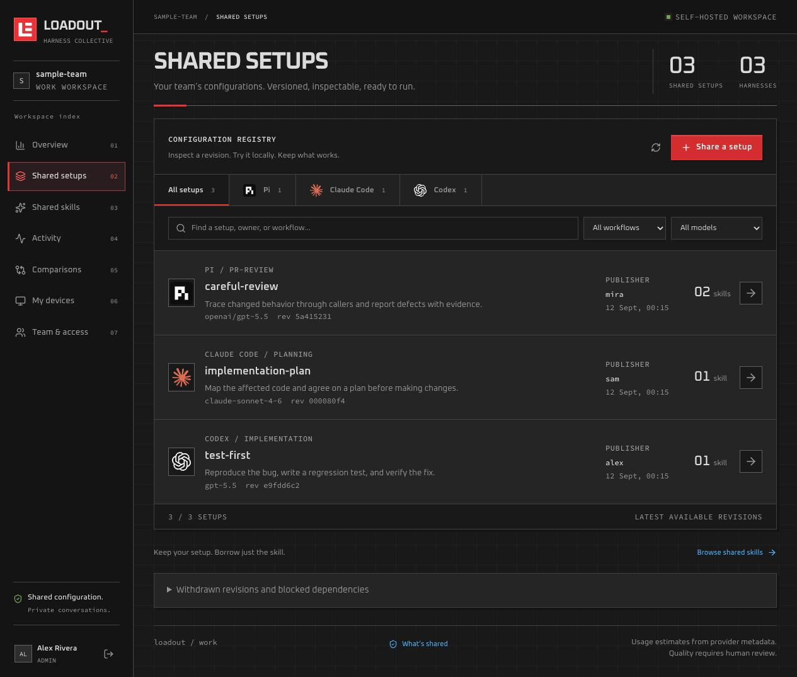

<p align="center">
  
</p>

<h1 align="center">Loadout</h1>

<p align="center">Share the setup behind the work.</p>

<p align="center">
  <a href="#get-started">Get started</a> ·
  <a href="TEAM.md">Team guide</a> ·
  <a href="#what-gets-shared">What gets shared</a>
</p>

Loadout is a self-hosted workspace for sharing Pi, Claude Code, Codex, Cursor, and OpenCode setups and reusable skills. Usage measurements currently cover Pi, Claude Code, and Codex.

Want to try your colleague's code review setup on your own code? Inspect the files, pull a specific revision, and run it locally. You can also borrow a single skill without adopting their whole setup.

[](docs/images/shared-setups.png)

<p align="center"><sub>The shared setup library, shown with sample names and configurations.</sub></p>

## Get started

You'll need Node.js 22.19 or newer, npm, and Git.

```sh
git clone https://github.com/luka-zivkovic/loadout.git
cd loadout
npm ci --ignore-scripts
npm run build
node dist/cli.js serve --data .registry --team loadout --scope work
```

The dashboard runs at `http://127.0.0.1:4318`. Open the private installation URL saved in `.registry/setup-link.txt` to create the first admin account. Any signed-in member can create a reusable, expiring team invitation link from **Team & access**; admins can also invite one person to a specific role. Each person chooses their own password.

Open **My devices** for connection instructions. Each device connects through your browser approval. Connecting a device doesn't publish its configuration or sync existing data.

To connect from other machines, serve the dashboard over HTTPS. The [account and deployment guide](AUTH.md) covers setup links, invitations, device access, and the reverse proxy configuration for a Node server. A dedicated dashboard host can omit the optional Pi runner dependency after building; see [Operations](OPERATIONS.md).

The pre-release Cloudflare deployment uses a Worker for the dashboard and API, with a SQLite Durable Object restricted to the EU for team data. Its workers.dev address and first-admin email are set in `wrangler.jsonc`. After creating a private `.registry/cloudflare-secrets.json` containing a random `BOOTSTRAP_SECRET`, run `npm run deploy:cloudflare -- --secrets-file .registry/cloudflare-secrets.json`. Run `npm run setup:cloudflare` to issue a 30-minute first-admin link. The workers.dev address is public; account, invitation, and device approval checks control access to team data.

## From your setup to a teammate's machine

1. **Capture and inspect once.** Save a local snapshot of your reusable configuration, then review its files and requirements. Choose whether to include a project folder.
2. **Publish a revision.** Choose exactly what to share with the team. Later edits stay local until you capture and publish again. No usage collector or background sync is required.
3. **Try it locally.** Inspect a colleague's revision and its changes, then pull it under a local name. Native setup exports go into a new configuration directory; your default setup stays in place.
4. **Optionally compare the results.** Set up usage collection separately, inspect measurements in the dashboard, and record your judgment. Named trials keep the candidate revision, results, and decision together.

Skills have their own version history and can be pinned into setups or installed separately. Compatibility is declared by the publisher; check a skill's instructions and dependencies before trying it in another harness.

See the [team workflow](TEAM.md) and [skill sharing guide](SKILLS-AND-HARNESSES.md) for the commands.

## Keep each harness native

Loadout preserves each harness's configuration format. It doesn't translate an entire Claude Code setup into a Pi or Codex setup.

| Harness     | Setup sharing                                       | Usage collection                               |
| ----------- | --------------------------------------------------- | ---------------------------------------------- |
| Pi          | Versioned profiles, skills, prompts, and extensions | Opt-in Pi extension and controlled review runs |
| Claude Code | Native configuration snapshots and skills           | Local telemetry adapter                        |
| Codex       | Native configuration snapshots and skills           | Local telemetry adapter                        |
| Cursor      | Project rules, commands, agents, hooks, and skills   | Not yet collected                              |
| OpenCode    | Project configuration, agents, commands, plugins, and skills | Not yet collected                       |

For a controlled code review comparison, the Pi runner gives each setup a fresh copy of the same frozen Git change and supplied context. Code and generated reviews stay on the machine running it. See the [Pi workflow guide](docs/PI-WORKFLOWS.md).

Claude Code and Codex measurements describe observed usage. They don't establish equal task context, task completion, or the exact configuration used at runtime. Costs are usage estimates, and missing measurements stay unavailable. Tool counts and observed skill reads aren't quality scores.

## What gets shared

Workspace members can see the setup revisions and skills you publish, plus the measurements you sync.

| Shared with the workspace | Excluded from analytics sync |
| --- | --- |
| Selected configuration files, reusable instructions, skill files, hooks, and extensions you publish | Conversations, reasoning, and session traces |
| Member profiles (name, handle, optional job title and company team), device identifiers, workflow labels, timestamps, and setup revisions | Task prompts, source code, diffs, and context documents |
| Model, tool, and skill names; usage counters; available cost estimates; human assessments | Raw tool inputs and outputs, credentials, and generated reviews |

Reusable files are intentionally shared content. Native setup capture records MCP server names only; connection details stay local. Review other files before publishing: credential filtering is best effort, and instructions or scripts can contain private information. Work and personal stores are separate, but the scope doesn't scrub file contents or choose your model account.

Configuration publication is explicit. `team sync` exchanges saved measurements and catalogue metadata; `--watch` repeats that sync. Neither publishes local configuration changes nor installs newer revisions. Optional source checks can report drift without publishing it.

The same disclosure is available under **What's shared** in the app and during device onboarding.

## Development and guides

```sh
npm run check
npm test
npm run demo
```

The demo exercises Pi comparisons against a scripted local provider, with no credentials or paid model calls. It writes a comparison report and metadata export. See [validation](VALIDATION.md) for coverage and native harness smoke checks.

Use `node dist/cli.js --help` for the CLI reference, or run `npm link` in this checkout to use the `loadout` command.

- [Accounts and deployment](AUTH.md): first admin, invitations, device approval, and HTTPS.
- [Team workflows](TEAM.md): publishing, sync, revision history, and local trials.
- [Skills and native harnesses](SKILLS-AND-HARNESSES.md): capture, installation, and telemetry.
- [Pi workflows](docs/PI-WORKFLOWS.md): frozen context, comparisons, and review assessments.
- [Operations](OPERATIONS.md): backups, quotas, withdrawal, and recovery.

Loadout is early software. Extensions run as trusted local code. SSO, MFA, and automated invitation emails aren't implemented. Existing Pi Share installations retain their `.pi-share` stores and CLI alias.
